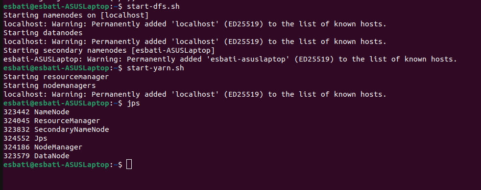
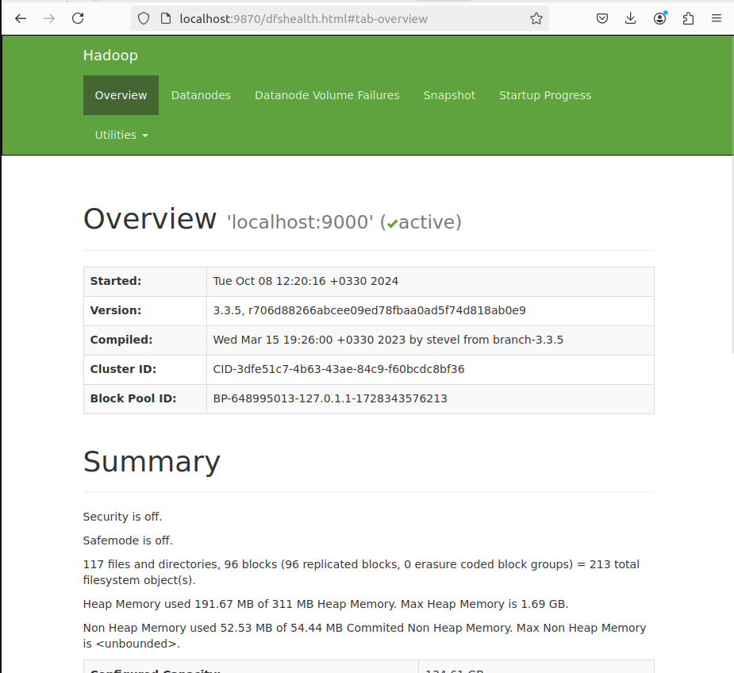
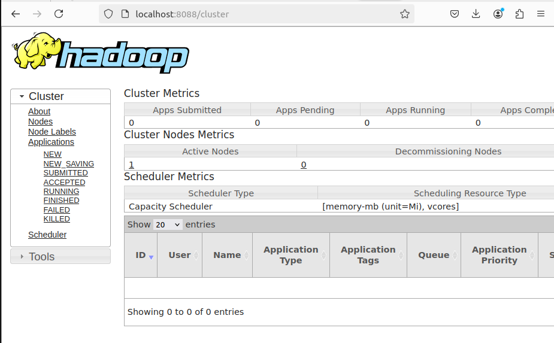

# Hadoop Installation and Configuration on a Single Node Cluster

Based on the [Hadoop Single Node Cluster Setup Documentation](https://hadoop.apache.org/docs/stable/hadoop-project-dist/hadoop-common/SingleCluster.html), this guide provides a step-by-step procedure to install and configure Hadoop on a single-node cluster. The instructions also include solutions to common issues encountered during the process.

## Prerequisites:
- **Operating System:** Linux distribution (e.g., Ubuntu)
- **Java:** Ensure Java is installed on your system, as Hadoop requires Java 8 or a compatible version.

### Step 1: Install Java
Hadoop depends on Java to function, so the first step is installing Java.

1. **Update your package repository:**
   ```bash
   sudo apt-get update
   ```

2. **Install Java 8 (OpenJDK):**
   ```bash
   sudo apt-get install openjdk-8-jdk
   ```

3. **Verify Java installation:**
   ```bash
   java -version
   ```
   This command should output Java version 8.

4. **Set Java environment variables:**
   Open your `.bashrc` file:
   ```bash
   nano ~/.bashrc
   ```
   Add the following lines to set up the Java environment:
   ```bash
   export JAVA_HOME=/usr/lib/jvm/java-8-openjdk-amd64
   export PATH=$PATH:$JAVA_HOME/bin
   ```
   Save the file and run:
   ```bash
   source ~/.bashrc
   ```

### Step 2: Download and Install Hadoop

1. **Download the latest stable version of Hadoop:**
   ```bash
   wget https://dlcdn.apache.org/hadoop/common/hadoop-3.4.0/hadoop-3.4.0.tar.gz
   ```

2. **Extract the downloaded file:**
   ```bash
   tar -xzvf hadoop-3.4.0.tar.gz
   ```

3. **Move the extracted files to `/usr/local/hadoop`:**
   ```bash
   sudo mv hadoop-3.4.0 /usr/local/hadoop
   ```

### Step 3: Configure Hadoop Environment Variables

1. Open your `.bashrc` file to add Hadoop environment variables:
   ```bash
   nano ~/.bashrc
   ```

2. Add the following lines to the file:
   ```bash
   export HADOOP_HOME=/usr/local/hadoop
   export HADOOP_INSTALL=$HADOOP_HOME
   export HADOOP_MAPRED_HOME=$HADOOP_HOME
   export HADOOP_COMMON_HOME=$HADOOP_HOME
   export HADOOP_HDFS_HOME=$HADOOP_HOME
   export YARN_HOME=$HADOOP_HOME
   export HADOOP_COMMON_LIB_NATIVE_DIR=$HADOOP_HOME/lib/native
   export PATH=$PATH:$HADOOP_HOME/sbin:$HADOOP_HOME/bin
   export LD_LIBRARY_PATH=$HADOOP_COMMON_LIB_NATIVE_DIR:$LD_LIBRARY_PATH
   export PDSH_RCMD_TYPE=ssh
   ```

3. Save the file and apply the changes:
   ```bash
   source ~/.bashrc
   ```

---

### Step 4: Configure Hadoop Files

Hadoop uses several configuration files located in `$HADOOP_HOME/etc/hadoop`. These files control the behavior of Hadoop daemons and services.

#### 1. core-site.xml
Open the file:
```bash
nano $HADOOP_HOME/etc/hadoop/core-site.xml
```
Add the following content:
```xml
<configuration>
   <property>
      <name>fs.defaultFS</name>
      <value>hdfs://localhost:9000</value>
   </property>
</configuration>
```

#### 2. hdfs-site.xml
Open it:
```bash
nano $HADOOP_HOME/etc/hadoop/hdfs-site.xml
```
Add the following content:
```xml
<configuration>
   <property>
      <name>dfs.replication</name>
      <value>1</value>
   </property>
   <property>
      <name>dfs.namenode.name.dir</name>
      <value>file:///usr/local/hadoop/hdfs/namenode</value>
   </property>
   <property>
      <name>dfs.datanode.data.dir</name>
      <value>file:///usr/local/hadoop/hdfs/datanode</value>
   </property>
</configuration>
```

#### 3. mapred-site.xml
Create the file by copying the template:
```bash
cp $HADOOP_HOME/etc/hadoop/mapred-site.xml.template $HADOOP_HOME/etc/hadoop/mapred-site.xml
```
Add the following:
```xml
<configuration>
   <property>
      <name>mapreduce.framework.name</name>
      <value>yarn</value>
   </property>
</configuration>
```

#### 4. yarn-site.xml
Open the file:
```bash
nano $HADOOP_HOME/etc/hadoop/yarn-site.xml
```
Add the following content:
```xml
<configuration>
   <property>
      <name>yarn.nodemanager.aux-services</name>
      <value>mapreduce_shuffle</value>
   </property>
   <property>
      <name>yarn.nodemanager.env-whitelist</name>
      <value>JAVA_HOME</value>
   </property>
   <property>
      <name>yarn.nodemanager.aux-services.mapreduce_shuffle.class</name>
      <value>org.apache.hadoop.mapred.ShuffleHandler</value>
   </property>
</configuration>
```

#### 5. hadoop-env.sh
Open it:
```bash
nano /usr/local/hadoop/etc/hadoop/hadoop-env.sh
```
Add the following line to define the directory where Hadoop logs will be written:
```bash
export HADOOP_LOG_DIR=${HADOOP_HOME}/logs
```

### Step 5: Set Up Passwordless SSH
1. **Install OpenSSH:**
   ```bash
   sudo apt-get install openssh-server
   ```

2. **Generate SSH keys:**
   ```bash
   ssh-keygen -t rsa -P ""
   ```

3. **Add SSH key to authorized keys:**
   ```bash
   cat ~/.ssh/id_rsa.pub >> ~/.ssh/authorized_keys
   ```

4. **Verify the SSH setup:**
   ```bash
   ssh localhost
   ```

---

### Step 6: Understanding `PDSH_RCMD_TYPE=ssh`

When configuring Hadoop in a pseudo-distributed environment, Hadoop uses SSH for communication between its components. To avoid permission issues, add the following line to your `.bashrc` file:
```bash
export PDSH_RCMD_TYPE=ssh
```

---

### Step 7: Format the NameNode
```bash
hdfs namenode -format
```

### Step 8: Start Hadoop Services
1. **Start HDFS:**
   ```bash
   start-dfs.sh
   ```

2. **Start YARN:**
   ```bash
   start-yarn.sh
   ```

---

### Step 9: Verify Installation
1. Access the Hadoop NameNode Web UI at [http://localhost:9870](http://localhost:9870).

2. Check YARN's ResourceManager Web UI at [http://localhost:8088](http://localhost:8088).


