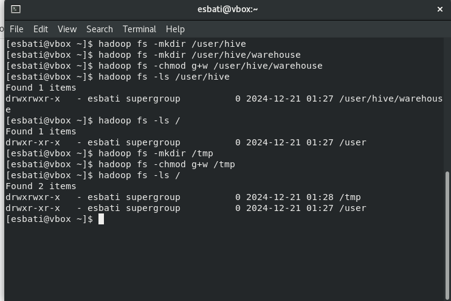
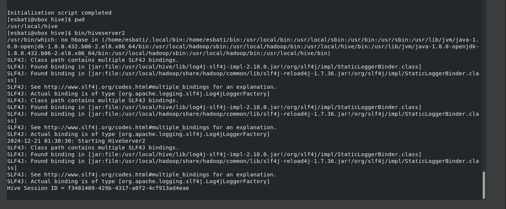
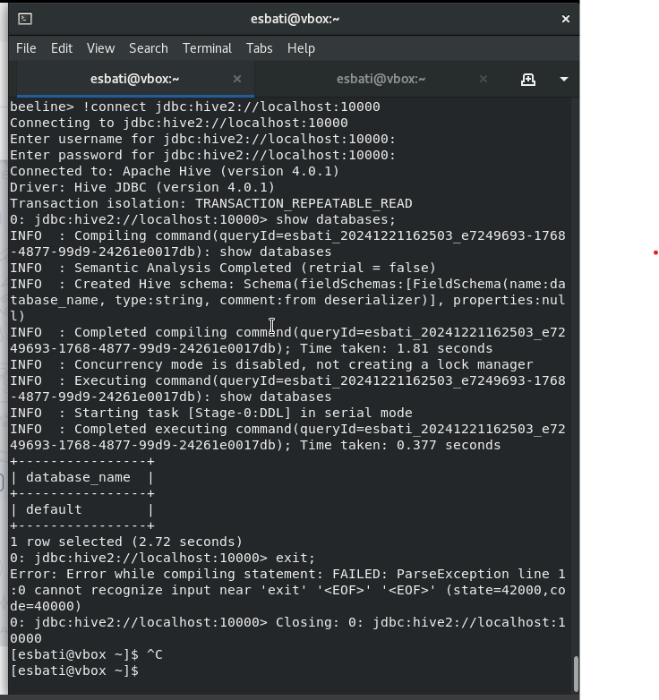

# Apache Hive 4.0.1 Installation and Configuration on Rocky Linux

This document provides a comprehensive guide to install and configure Apache Hive 4.0.1 on Rocky Linux, including setting up Hadoop's `core-site.xml` and configuring Hive with MySQL as its metastore.

---

## 1. Prerequisites

### 1.1 Update Rocky Linux
```bash
sudo dnf update -y
```

### 1.2 Install Java
Hive and Hadoop require Java. Install OpenJDK 8:
```bash
sudo dnf install java-1.8.0-openjdk-devel -y
java -version
```
Set `JAVA_HOME` in the `~/.bashrc` file:
```bash
echo "export JAVA_HOME=$(dirname $(dirname $(readlink $(readlink $(which java)))))" >> ~/.bashrc
echo "export PATH=$PATH:$JAVA_HOME/bin" >> ~/.bashrc
source ~/.bashrc
```

### 1.3 Install MySQL Server
Hive uses MySQL as a metastore. Install MySQL server:
```bash
sudo dnf install mysql-server -y
sudo systemctl enable --now mysqld
sudo mysql_secure_installation
```

---

## 2. Configure Hadoop Core

Hive requires Hadoop's configuration for connecting to HDFS. Edit the `core-site.xml` file:

### 2.1 Locate and Open `core-site.xml`
```bash
sudo nano /usr/local/hadoop/etc/hadoop/core-site.xml
```

### 2.2 Add the Configuration
Inside the `<configuration>` tags, add the following:
```xml
<configuration>
    <property>
        <name>fs.defaultFS</name>
        <value>hdfs://localhost:9000</value>
    </property>

    <property>
        <name>hadoop.proxyuser.esbati.groups</name>
        <value>*</value>
    </property>

    <property>
        <name>hadoop.proxyuser.esbati.hosts</name>
        <value>*</value>
    </property>

    <property>
        <name>hadoop.proxyuser.server.hosts</name>
        <value>*</value>
    </property>

    <property>
        <name>hadoop.proxyuser.server.groups</name>
        <value>*</value>
    </property>
</configuration>

```

---

## 3. Install Apache Hive

### 3.1 Download Hive 4.0.1
```bash
wget https://downloads.apache.org/hive/hive-4.0.1/apache-hive-4.0.1-bin.tar.gz
```

### 3.2 Extract and Move Hive
```bash
tar -xzvf apache-hive-4.0.1-bin.tar.gz
sudo mv apache-hive-4.0.1-bin /usr/local/hive
```

### 3.3 Set Hive Environment Variables
Add the following to `~/.bashrc`:
```bash
echo "export HIVE_HOME=/usr/local/hive" >> ~/.bashrc
echo "export PATH=$PATH:$HIVE_HOME/bin" >> ~/.bashrc
source ~/.bashrc
```

---

## 4. Configure Hive

### 4.1 Create Hive Directories
```bash
mkdir -p /usr/local/hive/warehouse
mkdir -p /usr/local/hive/logs
```
Or You Can Make In Hadoop:




### 4.2 Edit Hive Environment
Open the `hive-env.sh` file:
```bash
nano $HIVE_HOME/conf/hive-env.sh
```
Add:
```bash
export HADOOP_HOME=/usr/local/hadoop
export HIVE_HOME=/usr/local/hive
export HIVE_CONF_DIR=$HIVE_HOME/conf
export JAVA_HOME=$(dirname $(dirname $(readlink $(readlink $(which java)))))
```

### 4.3 Edit Hive Configuration
Open the `hive-site.xml` file:
```bash
nano $HIVE_HOME/conf/hive-site.xml
```
Add:
```xml
<configuration>
    <!-- WARNING!!! This file is auto generated for documentation purposes ONLY! -->
    <!-- WARNING!!! Any changes you make to this file will be ignored by Hive.   -->
    <!-- WARNING!!! You must make your changes in hive-site.xml instead.         -->
    <!-- Hive Execution Parameters -->

    <!-- Hive Metastore Configuration -->
    <property>
        <name>javax.jdo.option.ConnectionURL</name>
        <value>jdbc:mysql://localhost:3306/hive</value>
        <description>JDBC connect string for a MySQL metastore database</description>
    </property>

    <property>
        <name>javax.jdo.option.ConnectionDriverName</name>
        <value>com.mysql.cj.jdbc.Driver</value>
        <description>Driver class for MySQL JDBC</description>
    </property>

    <property>
        <name>javax.jdo.option.ConnectionUserName</name>
        <value>esbati</value>
        <description>Username for the MySQL metastore</description>
    </property>

    <property>
        <name>javax.jdo.option.ConnectionPassword</name>
        <value>esbati79</value>
        <description>Password for the MySQL metastore</description>
    </property>

    <property>
        <name>hive.metastore.warehouse.dir</name>
        <value>/usr/local/hive/warehouse</value>
        <description>Location of Hive's data warehouse directory</description>
    </property>

    <!-- HiveServer2 Configuration -->
    <property>
        <name>hive.server2.authentication</name>
        <value>NONE</value>
        <description>Set the authentication mode for HiveServer2</description>
    </property>

    <property>
        <name>hive.server2.enable.doAs</name>
        <value>true</value>
        <description>Enable user impersonation</description>
    </property>

    <property>
        <name>hive.server2.thrift.port</name>
        <value>10000</value>
        <description>Port number for HiveServer2</description>
    </property>

    <!-- Proxy User Configuration for Impersonation -->
    <property>
        <name>hadoop.proxyuser.esbati.hosts</name>
        <value>*</value>
        <description>Hosts from which the user 'esbati' can connect</description>
    </property>

    <property>
        <name>hadoop.proxyuser.esbati.groups</name>
        <value>*</value>
        <description>Groups that the user 'esbati' belongs to</description>
    </property>

    <!-- Optional Configuration -->
    <property>
        <name>hive.execution.engine</name>
        <value>mr</value>
        <description>Execution engine for Hive queries (mr = MapReduce, tez = Tez, spark = Spark)</description>
    </property>

    <property>
        <name>hive.exec.scratchdir</name>
        <value>/tmp/hive</value>
        <description>Temporary directory for Hive query results</description>
    </property>

    <property>
        <name>hive.log.dir</name>
        <value>/usr/local/hive/logs</value>
        <description>Log directory for Hive</description>
    </property>

    <property>
        <name>hive.exec.scratchdir</name>
        <value>/tmp/hive</value>
        <description>Temporary directory on HDFS for query execution.</description>
    </property>
    <property>
        <name>hive.metastore.warehouse.dir</name>
        <value>hdfs://localhost:9000/usr/local/hive/warehouse</value>
        <description>Location of default database for the warehouse</description>
    </property>
</configuration>
```

---

## 5. Configure MySQL for Hive

### 5.1 Log in to MySQL
```bash
mysql -u root -p
```

### 5.2 Create Database and User
Run the following commands:
```sql
CREATE DATABASE hive;
CREATE USER 'esbati'@'localhost' IDENTIFIED BY 'esbati';
GRANT ALL PRIVILEGES ON hive.* TO 'esbati'@'localhost';
FLUSH PRIVILEGES;
EXIT;
```

### 5.3 Download and Add MySQL Connector
```bash
wget https://dev.mysql.com/get/Downloads/Connector-J/mysql-connector-java-8.0.33.tar.gz
tar -xzvf mysql-connector-java-8.0.33.tar.gz
sudo cp mysql-connector-java-8.0.33/mysql-connector-java-8.0.33.jar /usr/local/hive/lib
```

### 5.4 Initialize Hive Metastore Schema
Initialize the Hive metastore schema:
```bash
schematool -dbType mysql -initSchema
```

---

## 6. Start Hive

### 6.1 Launch Hive CLI
```bash
hive
```
```bash
!connect jdbc:hive2://localhost:10000
```

### 6.2 Start HiveServer2
Kill any running HiveServer2 processes and start HiveServer2 in the background:
```bash
pkill -f hive
hive --service hiveserver2 &
```

### 6.3 Verify Installation
Create a table and query it:
```sql
CREATE TABLE test_table (id INT, name STRING);
SHOW TABLES;
```






---

By following this guide, you can successfully install and configure Apache Hive 4.0.1 on Rocky Linux.
