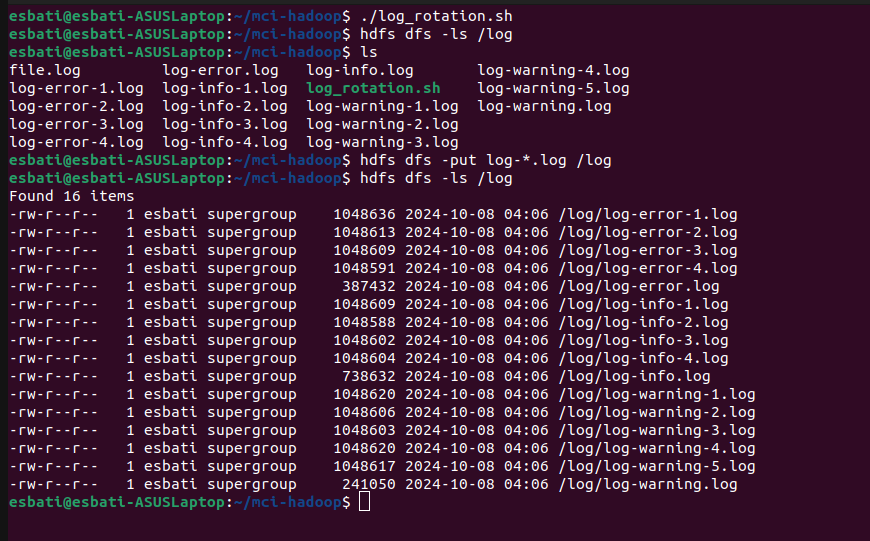

# Detailed Documentation of Tasks Completed

## Part 1: Log Rotation Script

### Objective
Create a Linux shell script that processes a log file (`file.log`) by reading it line by line from the end. The script should organize logs into separate files based on their log type (INFO, WARNING, ERROR).

### Process
1. **Read the `file.log` file from the end**:
   - Use `tac` to read the file from the end.
2. **Categorize each line into different log types**:
   - Use `grep` or `awk` to filter lines based on the log type.
3. **Save the categorized logs into separate files**:
   - Create separate files for INFO, WARNING, and ERROR logs.
4. **Handle file size limits**:
   - Check the size of each log file.
   - If a file exceeds 1 MB, create a new file with an incremental naming scheme.
5. **Ensure the latest logs go into the most recent file**:
   - Always append new logs to the main log file (`log-info.log`, `log-warning.log`, `log-error.log`).
   - Move older logs to incrementally named files when the size limit is reached.

### Example Script
```bash
#!/bin/bash

# Define the main log file and the categorized log files
LOG_FILE="file.log"
INFO_LOG="log-info.log"
WARNING_LOG="log-warning.log"
ERROR_LOG="log-error.log"

# Define the maximum size for each log file (1 MB in bytes)
MAX_SIZE=1048576

# Function to rotate log files if they exceed the maximum size
rotate_log() {
    local log_file=$1
    local base_name=$(basename "$log_file" .log)  # Get the base name of the log file
    local count=1

    # Find the next available suffix for the rotated log file
    while [ -f "${base_name}-${count}.log" ]; do
        ((count++))
    done

    # Move the current log file to a new file with the incremental suffix
    mv "$log_file" "${base_name}-${count}.log"
    touch "$log_file"  # Create a new empty log file
}

# Function to process the main log file and categorize logs
process_log() {
    local log_type=$1
    local log_file=$2

    # Read the main log file from the end using tac and filter lines based on the log type
    while IFS= read -r line; do
        echo "$line" >> "$log_file"  # Append the line to the corresponding log file
        if [ $(stat -c%s "$log_file") -gt $MAX_SIZE ]; then  # Check if the log file exceeds the maximum size
            rotate_log "$log_file"  # Rotate the log file if it exceeds the maximum size
        fi
    done < <(tac "$LOG_FILE" | grep "$log_type")  # Filter lines based on the log type
}

# Process INFO logs
process_log "INFO" "$INFO_LOG"

# Process WARNING logs
process_log "WARNING" "$WARNING_LOG"

# Process ERROR logs
process_log "ERROR" "$ERROR_LOG"
```


## Part 2: Hadoop and HDFS Integration

### Objective
Install Hadoop and use its file system (HDFS) to store the log files processed in Part 1.

### Steps
1. **Download and Install Hadoop**:
   - Download Hadoop 3.4.0 from the official website.
   - Extract the tar file and set up the environment variables.
   [Link to HOW TO INSTALL HADOOP in detail](./Hadoop_Installation_Configuration_Documentation.md)

2. **Create a Directory in HDFS**:
   - Use the command `hdfs dfs -mkdir /log`.
3. **Move Log Files to HDFS**:
   - Use the command `hdfs dfs -put <local_log_file> /log`.
4. **Verify the Files in HDFS**:
   - Use the command `hdfs dfs -ls /log` and capture the output.

### Example Commands
```bash
# Start Hadoop services
start-dfs.sh
start-yarn.sh

# Create HDFS directory
hdfs dfs -mkdir /log

# Move all log files to HDFS
hdfs dfs -put log-*.log /log

# Verify files in HDFS
hdfs dfs -ls /log
```

