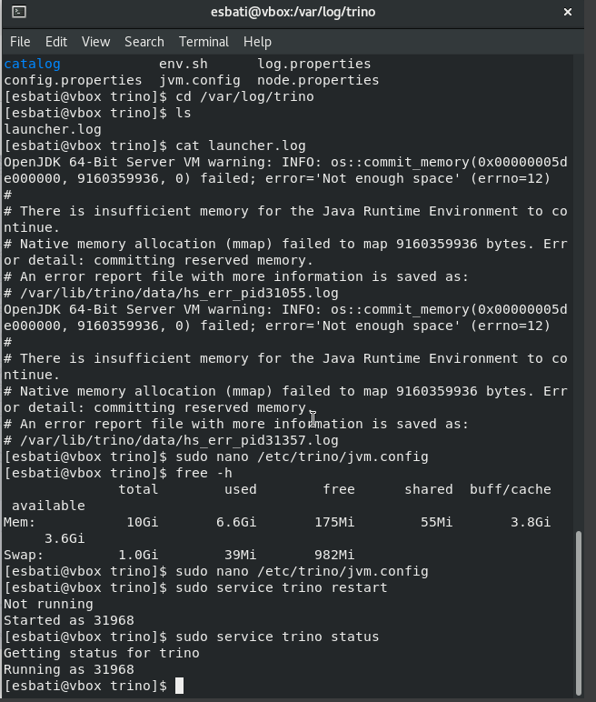
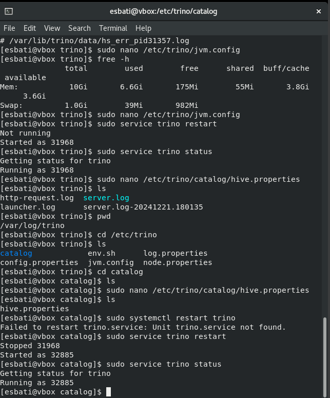
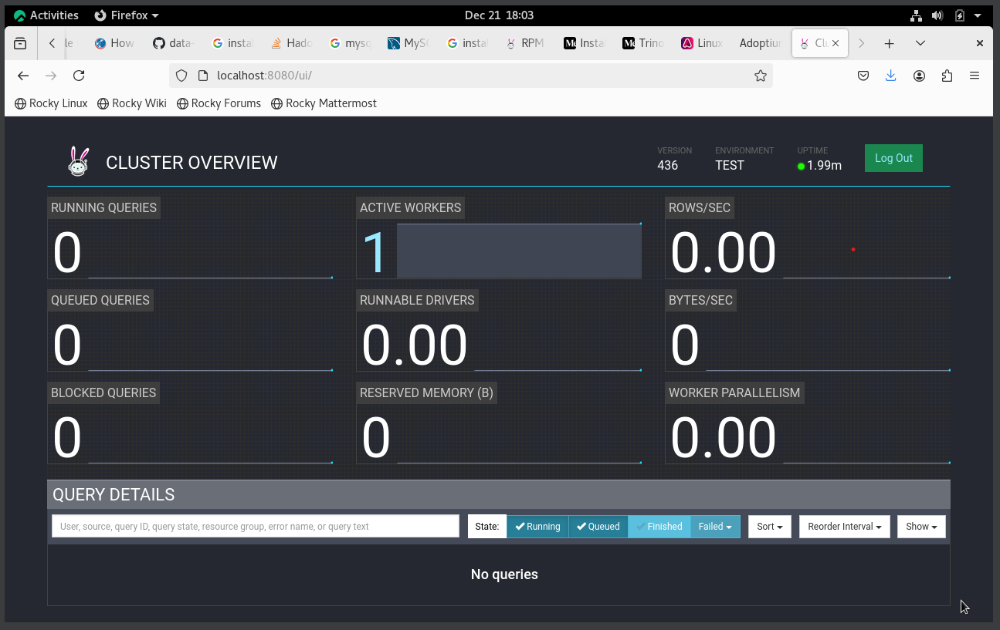

# Trino Installation and Configuration on Rocky Linux

This document provides a comprehensive guide to install and configure Trino on Rocky Linux, including common errors and their solutions.

---

## **1. Prerequisites**

### **1.1 Update the System**
Update all system packages to ensure compatibility:
```bash
sudo dnf update -y
```

### **1.2 Install Java**
Trino requires temurin java 21:
```bash
sudo bash -c 'cat <<EOF > /etc/yum.repos.d/adoptium.repo
[Adoptium]
name=Adoptium
baseurl=https://packages.adoptium.net/artifactory/rpm/${DISTRIBUTION_NAME:-$(. /etc/os-release; echo $ID)}/\$releasever/\$basearch
enabled=1
gpgcheck=1
gpgkey=https://packages.adoptium.net/artifactory/api/gpg/key/public
EOF'

```
Download From Here And Install it: 
```bash
wget https://packages.adoptium.net/artifactory/rpm/rocky/8/x86_64/Packages/temurin-21-jdk-21.0.5.0.0.11-1.x86_64.rpm
wget https://packages.adoptium.net/artifactory/rpm/rocky/8/x86_64/Packages/temurin-21-jre-21.0.5.0.0.11-1.x86_64.rpm

sudo dnf install temurin-21-*.rpm

https://packages.adoptium.net/ui/native/rpm/rocky/8/x86_64/Packages/
```
---

## **2. Download and Install Trino**

### **2.1 Download Trino**
Download the latest Trino tarball from the [official releases page](https://trino.io/download.html). Alternatively, use the following command:
```bash
wget https://repo1.maven.org/maven2/io/trino/trino-server-rpm/436/trino-server-rpm-436.rpm

sudo dnf install trino-server-rpm-436.rpm
```

### **2.2 Use the rpm command to install the package**
```bash
rpm -i trino-server-rpm-*.rpm --nodeps
```

---

## **3. Configure Trino**

### **3.1 Create Configuration Directory**
```bash
sudo mkdir -p /usr/local/trino/
```

### **3.2 Configure `node.properties`**
Create the `node.properties` file:
```bash
sudo nano /etc/trino/node.properties
```
Add the following configuration:
```properties
node.environment=production
node.id=00000000-0000-0000-0000-000000000000
node.data-dir=/usr/local/trino/data
```

### **3.3 Configure `jvm.config`**
Create the `jvm.config` file:
```bash
sudo nano /etc/trino/jvm.config
```
Add the following configuration:
if you get error while start up it less the memory(-Xmx2G, -Xms2G).
```properties
-server
-Xmx16G
-Xms16G
-XX:+UseG1GC
-XX:G1HeapRegionSize=32M
-XX:+ExplicitGCInvokesConcurrent
-XX:+ExitOnOutOfMemoryError
```

The error:




### **3.4 Configure `config.properties`**
Create the `config.properties` file:
```bash
sudo nano /etc/trino/config.properties
```
Add the following configuration:
```properties
coordinator=true
node-scheduler.include-coordinator=true
http-server.http.port=8080
discovery-server.enabled=true
discovery.uri=http://localhost:8080
```

#### Common Error:
- **Error:** `Port 8080 is already in use`  
  **Solution:** Change the port in the `http-server.http.port` property to an available port, e.g., `8081`.

### **3.5 Configure `log.properties`**
Create the `log.properties` file:
```bash
sudo nano /etc/trino/log.properties
```
Add:
```properties
io.trino=INFO
```

---

## **4. Create a Catalog**

Trino needs catalogs to connect to different data sources. As an example, we’ll configure the `hive` catalog.

### **4.1 Create the Hive Catalog**
```bash
sudo nano /etc/trino/catalog/hive.properties
```
Add:
```properties
connector.name=hive-hadoop2
hive.metastore.uri=thrift://localhost:9083
```

#### Common Error:
- **Error:** `Failed to connect to Hive metastore`  
  **Solution:** Ensure Hive metastore is running and reachable on the specified URI (`thrift://localhost:9083`).

---

## **5. Start Trino**

### **5.1 Run Trino**
Start Trino using the following command:
```bash
/etc/trino/bin/launcher run
```

#### Common Error:
- **Error:** `Exception in thread "main" java.lang.OutOfMemoryError`  
  **Solution:** Increase memory allocation in `jvm.config` by adjusting `-Xmx` and `-Xms`.

---

## **6. Access Trino**

### **6.1 Access Web Interface**
Open your browser and navigate to:
```
http://localhost:8080
```

### **6.2 Use Trino CLI**
Download the Trino CLI:
```bash
wget https://repo1.maven.org/maven2/io/trino/trino-cli/436/trino-cli-436-executable.jar -O trino
chmod +x trino
```

Run the CLI:
```bash
./trino --server localhost:8080 --catalog hive
```

---

## **7. Troubleshooting**

### **7.1 Node ID Conflict**
- **Error:** `Duplicate node ID detected`  
  **Solution:** Ensure each Trino node has a unique `node.id` in `node.properties`.

### **7.2 Catalog Not Found**
- **Error:** `Catalog does not exist: hive`  
  **Solution:** Verify the catalog configuration in `/usr/local/trino/etc/catalog/hive.properties`.

### **7.3 Authentication Errors**
- **Error:** `401 Unauthorized`  
  **Solution:** If you enable authentication, configure the `config.properties` file to include:
  ```properties
  http-server.authentication.type=BASIC
  http-server.authentication.users-file=/usr/local/trino/etc/users.properties
  ```

---

## **8. Automate Trino Startup**

### **8.1 Create a Systemd Service**
Create a systemd service file for Trino:
```bash
sudo nano /etc/systemd/system/trino.service
```
Add:
```ini
[Unit]
Description=Trino Server
After=network.target

[Service]
User=root
Group=root
ExecStart=/etc/trino/bin/launcher start
ExecStop=/etc/trino/bin/launcher stop
Restart=always

[Install]
WantedBy=multi-user.target
```

### **8.2 Enable and Start the Service**
```bash
sudo systemctl daemon-reload
sudo systemctl enable trino
sudo systemctl start trino
```



### **8.3 Verify the Service**
```bash
sudo systemctl status trino
```



---

By following this guide, you can successfully install and configure Trino on Rocky Linux.
