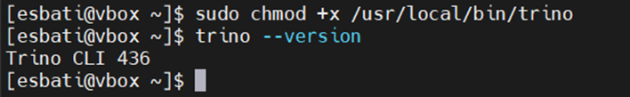
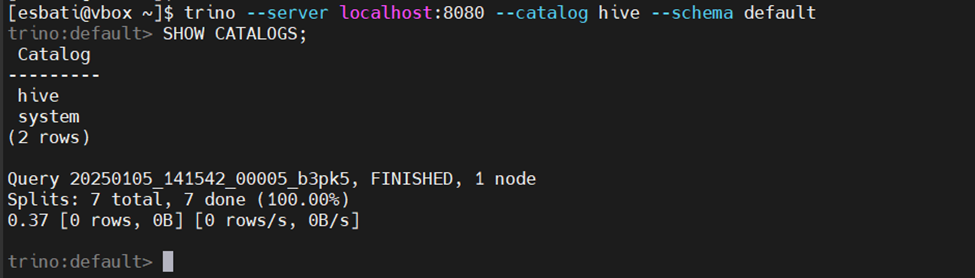

# Configuring Trino to Connect to Hive

Follow these steps to configure Trino for integration with Hive:

## Step 1: Create Catalog Configuration Directory
```bash
sudo mkdir /etc/trino/catalog
```

## Step 2: Create Hive Catalog Properties
Edit the `hive.properties` file:
```bash
sudo nano /etc/trino/catalog/hive.properties
```
Add the following properties:
```
connector.name=hive
hive.metastore.uri=thrift://<metastore-host>:<port>
```
Replace `<metastore-host>` and `<port>` with the appropriate values.

## Step 3: Update Hive Configuration
Edit the Hive configuration file:
```bash
nano /usr/local/hive/conf/hive-site.xml
```
Add the following property:
```xml
<property>
    <name>hive.metastore.uris</name>
    <value>thrift://<metastore-host>:<port></value>
</property>
```
Ensure the `<metastore-host>` and `<port>` match those specified in the `hive.properties` file.

## Step 4: Set Permissions for Catalog Directory
Set ownership and permissions for the catalog directory:
```bash
sudo chown -R trino:trino /etc/trino/catalog
sudo chmod -R 755 /etc/trino/catalog
```

## Step 5: Download and Install Trino CLI
Download the Trino CLI executable:
```bash
wget --no-check-certificate https://search.maven.org/remotecontent?filepath=io/trino/trino-cli/436/trino-cli-436-executable.jar -O trino-cli-436-executable.jar
```
Move the executable to a location in the system's PATH:
```bash
sudo mv trino-cli-436-executable.jar /usr/local/bin/trino
```
Make the file executable:
```bash
sudo chmod +x /usr/local/bin/trino
```

## Step 6: Verify Installation
Check the Trino CLI version:
```bash
trino --version
```



Verify the Hive connection using the following command:
```bash
trino --server localhost:8080 --catalog hive --schema default
```



If successful, you should see the version number of the installed Trino CLI.

