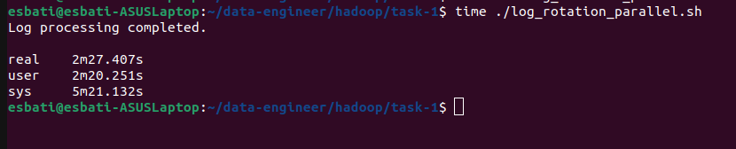

# Log Rotation Script Performance Comparison

## Overview
We have two versions of a Bash script that process log files (INFO, WARNING, ERROR) and rotate them when they exceed a given size. The key difference between the scripts is that one processes the logs **in parallel** while the other does so **sequentially**.

### 1. **Script 1: Parallel Processing**

```bash
#!/bin/bash

# Define log files
LOG_FILE="file.log"
INFO_LOG="log-info.log"
WARNING_LOG="log-warning.log"
ERROR_LOG="log-error.log"

# Define max size for logs (1 MB)
MAX_SIZE=1048576

# Rotate log function
rotate_log() { ... }

# Function to process logs
process_log() { ... }

# Process logs in parallel
process_log "INFO" "$INFO_LOG" &
process_log "WARNING" "$WARNING_LOG" &
process_log "ERROR" "$ERROR_LOG" &

wait  # Wait for all background processes to finish

echo "Log processing completed."
```

- **Parallelism**: Each log type (INFO, WARNING, ERROR) is processed concurrently.
- **Performance**: Utilizes system resources more efficiently by running multiple processes at once.

#### Runtime (Parallel Script):
- **Real Time**: 2m27.407s
- **User Time**: 2m20.251s
- **System Time**: 5m21.132s



### Explanation of Parallel Technique:

1. **Background Processes (`&`)**: 
   - Each `process_log` call is run in the background using `&`. This allows the script to start multiple tasks (INFO, WARNING, ERROR log processing) concurrently rather than waiting for one to finish before starting the next.
   
2. **Concurrency**: 
   - By running the log processing functions in parallel, the system can take advantage of multiple CPU cores and handle I/O-bound tasks simultaneously. This leads to reduced `real` time.
   
3. **`wait` Command**: 
   - The `wait` command ensures that the script pauses and waits for all the background processes to complete before it proceeds to the final output, ensuring all logs are fully processed.

4. **I/O Operations**: 
   - Since the tasks involve reading and writing logs (I/O-bound operations), parallelism helps optimize time by processing these tasks simultaneously during the I/O wait times.

5. **System Resources**: 
   - Parallel execution incurs some additional overhead (`sys` time) for managing multiple background processes, but this is compensated by the significant reduction in `real` time.

### 2. **Script 2: Sequential Processing**

```bash
#!/bin/bash

# Define log files
LOG_FILE="file.log"
INFO_LOG="log-info.log"
WARNING_LOG="log-warning.log"
ERROR_LOG="log-error.log"

# Define max size for logs (1 MB)
MAX_SIZE=1048576

# Rotate log function
rotate_log() { ... }

# Function to process logs
process_log() { ... }

# Process logs sequentially
process_log "INFO" "$INFO_LOG"
process_log "WARNING" "$WARNING_LOG"
process_log "ERROR" "$ERROR_LOG"
```

- **Sequential Processing**: Each log type is processed one after another.
- **Performance**: Processing time is higher since each step waits for the previous one to finish.

#### Runtime (Sequential Script):
- **Real Time**: 5m47.059s
- **User Time**: 1m53.569s
- **System Time**: 4m1.602s


### Conclusion:
- **Parallel Execution** reduced the total elapsed time (`real`) by more than half, from 5m47s to 2m27s.
- Although the system overhead (`sys` time) was slightly higher in parallel execution, the overall reduction in `real` time makes this method far more efficient for log processing.

